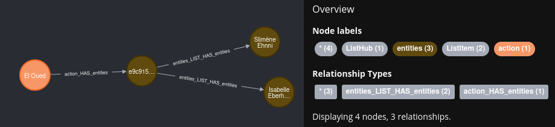
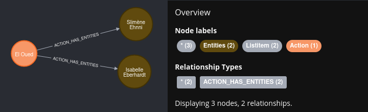

## Dict2graph

Transfer (json compatible) Python dicts into a Neo4j graph database.  
dict2graph also comes with some powerful data transform capabilities.

**Maintainer**: Tim Bleimehl - bleimehl@dzd-ev.de

**Licence**: MIT

**public issue tracker**: [https://github.com/dzd-ev/dict2graph-docs/issues](https://github.com/dzd-ev/dict2graph-docs/issues)

**user docs**: [https://dzd-ev.github.io/dict2graph-docs/](https://dzd-ev.github.io/dict2graph-docs/)

**source code**: [https://git.connect.dzd-ev.de/dzdpythonmodules/dict2graph](https://git.connect.dzd-ev.de/dzdpythonmodules/dict2graph)

**important upstream modules**:

* [https://github.com/kaiserpreusse/graphio](https://github.com/kaiserpreusse/graphio)  
* [https://github.com/neo4j/neo4j-python-driver](https://github.com/neo4j/neo4j-python-driver)  
* [https://github.com/py2neo-org/py2neo](https://github.com/py2neo-org/py2neo)  

----

**Content**:

- [Dict2graph](#dict2graph)
- [Install](#install)
- [What is dict2graph](#what-is-dict2graph)
  - [Recommended workflow](#recommended-workflow)
  - [What dict2graph is **not**](#what-dict2graph-is-not)
- [py2neo depcrecation warning](#py2neo-depcrecation-warning)
- [Basic Usage Example](#basic-usage-example)
  - [Load a dict](#load-a-dict)
  - [Transform the model](#transform-the-model)

----

## Install

`pip3 install dict2graph`

## What is dict2graph 

With dict2graph you can transfer python dicts into a neo4j graph out of the box.  
And if you are not happy with the structure of the result, dict2graph comes with a bunch of, transformation tools, which are easy to apply to your model.

### Recommended workflow

The recommended workflow is:

- Load your dict (or a sample of your larger datasets) as it is, with dict2graph into a neo4j test instance
- Inspect the result in neo4j
- Add dict2graph-transformers to shape your resulting graph model
- Wipe your neo4j test instance
- Repeat the work flow with the changed dict2graph-transformers until your happy with the result

### What dict2graph is **not**

dict2graph can **not** be used for de-/serializing your dict into a graph database. There is no `graph2dict` functionality (nore is it planned to have one).  
Your data/dict will be transformed to be more suitable in a graph represantation. On the way, certain informations can be lost. Reproducing the exact same dict from the graph is not possible in many cases.

## py2neo depcrecation warning

In past versions of `dict2graph`, the awesome [`py2neo`](https://py2neo.org/2021.1/) library was the only way to connect to a Neo4j instance.  
But (sadly) this lib is in a low-maintanance mode. For now it is still supported but marked as deprecated. We recommend to switch to the official [Neo4j Python Driver](https://neo4j.com/docs/api/python-driver/current/). 

## Basic Usage Example

With formalities out of the way, lets have some simple examples how dict2graph works...

### Load a dict


```python
from dict2graph import Dict2graph
from neo4j import GraphDatabase

# connect to our neo4j database
NEO4J_DRIVER = GraphDatabase.driver("neo4j://localhost")

# lets create a small random  dict
dic = {
    "action": {
        "id": 1,
        "target": "El Oued",
        "entities": [{"id": "Isabelle Eberhardt"}, {"id": "Slimène Ehnni"}],
    }
}
# create a dict2graph instance, 
# parse the dict 
# and load it into our neo4j instance.
Dict2graph().parse(dic).create(NEO4J_DRIVER)
```

This will result in following graph:



### Transform the model

We now have loaded the dict data into a Neo4j Graph. But usally we dont need stuff like explicit `list`s in a graph. Also it is common to uppercase relationship types and capitalize labels.

So we need to make some adjustments to improve the graph represenation of the dict.  
This is where `dict2graph.Transformer`s come into play.

```python
from dict2graph import Dict2graph, Transformer, NodeTrans, RelTrans
from py2neo import Graph
NEO4J_DRIVER = GraphDatabase.driver("neo4j://localhost")
data = {
    "action": {
        "id": 1,
        "target": "El Oued",
        "entities": [{"id": "Isabelle Eberhardt"}, {"id": "Slimène Ehnni"}],
    }
}
d2g = Dict2graph()
d2g.add_transformation(
    [
        Transformer.match_nodes().do(NodeTrans.CapitalizeLabels()),
        Transformer.match_rels().do(RelTrans.UppercaseRelationType()),
        Transformer.match_nodes().do(NodeTrans.PopListHubNodes()),
    ]
)
d2g.parse(data)
d2g.create(NEO4J_DRIVER)
```

Now that looks more like a graph we are used to, isn't it?



 There are a lot of more powerful [`Transformer`s](https://dzd-ev.github.io/dict2graph-docs/list_generic_transformer) and you can even [make your own](https://dzd-ev.github.io/dict2graph-docs/diy_transformer/) 🚀!  
 Have a deeper look into the docs to [learn more how Transformers work](https://dzd-ev.github.io/dict2graph-docs/use_transformers/).