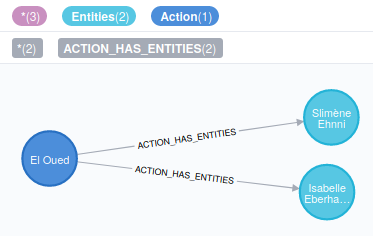
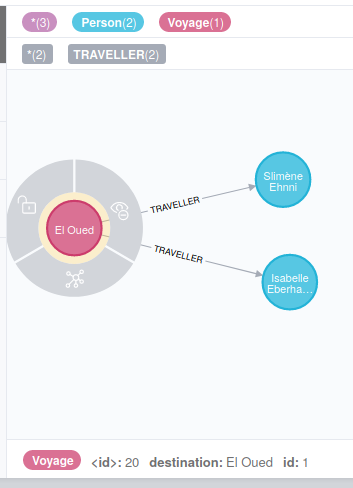
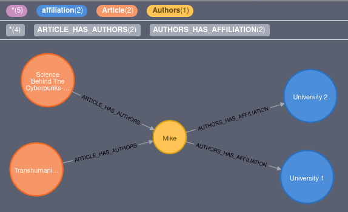
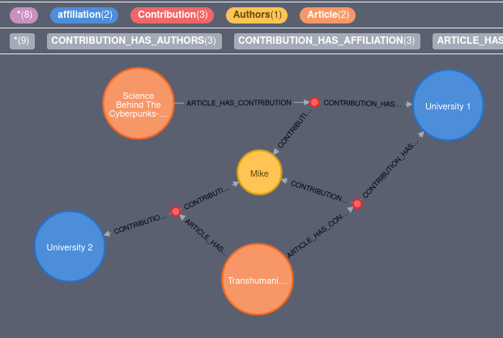

# Dict2graph

Transfer python dict data into a neo4j graph with the help of https://github.com/kaiserpreusse/graphio

dict2graph comes with some data transform capabilities.

## About

**Maintainer**: tim.bleimehl@dzd-ev.de

**Licence**: MIT

**issue tracker**: https://git.connect.dzd-ev.de/dzdtools/pythonmodules/-/issues?label_name%5B%5D=DZDdict2graph

## Content

[[_TOC_]]

## Install

**Stable**

BRANCH: master

`pip3 install git+https://git.connect.dzd-ev.de/dzdpythonmodules/dict2graph.git`

**Dev**

BRANCH: dict2graph-dev

`pip3 install git+https://git.connect.dzd-ev.de/dzdpythonmodules/dict2graph.git@dev`

## Usage

With dict2graph you can transfer python dicts into a neo4j graph out of the box. If you are not happy with the structure of the result, dict2graph comes with a bunch of transformation tools.

The recommended workflow is:

- Load your json (or a sample of your larger datasets) as it is, with json2graph into a neo4j test instance
- Inspect the result in neo4j
- Tune the dict2graph config parameters
- Wipe your neo4j test instance
- Repeat the work flow with the changed config parameters until your happy with the result

### Get started

Lets start with a simple example.

#### Load json as it is

```python
from dict2graph import Dict2graph
from py2neo import Graph

json = {
    "Action": {
        "id": 1,
        "target": "El Oued",
        "Entities": [{"id": "Isabelle Eberhardt"}, {"id": "Slimène Ehnni"}],
    }
}
d2g = Dict2graph()
d2g.load_json(json)
d2g.merge(Graph())
```

This will result in following graph:


#### Transform the model

Now we can use some of the config variables to change the model to something that feels more inutitive as a graph model

First we can remove the Collection Hub, which is needed by default to distinct nested lists. But as we can assure there are no nested list in our source data, we can disable them with `config_list_blocklist_collection_hubs`:

```python
from dict2graph import Dict2graph
from py2neo import Graph

json = {
    "Action": {
        "id": 1,
        "target": "El Oued",
        "Entities": [{"id": "Isabelle Eberhardt"}, {"id": "Slimène Ehnni"}],
    }
}
d2g = Dict2graph()
# we can disable specific Collection Hubs by providing a list with it names or disable Collection hubs globaly by providing the string "all"
d2g.config_list_blocklist_collection_hubs = ["all"]
d2g.load_json(json)
d2g.merge(Graph())
```

Now we directly connect our :Action to the :Entities



As a next step we could rename labels, relationship types and properties with the help of `config_dict_label_override`, `config_dict_reltype_override` and `config_dict_property_name_override` to something more suitable:

```python
from dict2graph import Dict2graph
from py2neo import Graph

json = {
    "Action": {
        "id": 1,
        "target": "El Oued",
        "Entities": [{"id": "Isabelle Eberhardt"}, {"id": "Slimène Ehnni"}],
    }
}
d2g = Dict2graph()
d2g.config_list_blocklist_collection_hubs = ["all"]
d2g.config_dict_label_override = {"Action":"Voyage", "Entities":"Person"}
d2g.config_dict_reltype_override = {"VOYAGE_HAS_PERSON":"TRAVELLER"}
d2g.config_dict_property_name_override = {"Person":{"id":"Fullname"}, "Voyage":{"target":"destination"}}
d2g.load_json(json)
d2g.merge(Graph())
```

This results in a graph like:



There are a lot more possible ways to transform your data before pushing it to the neo4j graph. Browse the specifications to explore all capabilities...

## Specifications

### Methods

**Dict2graph.load_json(data,parent_label_name=None)**

- Description: Transform json data into multiple graphio.nodeset and graphio.relationset . You can apply `load_json` multiple time on a Dict2graph instance
- Parameters:

  - data:
    - Type: dict or string
    - default: Non optional - no default
    - notes: if using str it must containing valid json. if using dict type it must not contain complex types
  - parent_label_name
    - Type: string
    - default: None
    - notes: Defines a parent label for top level json data. e.g. `parent_label_name=None` on the json `{"name":"Isabelle Eberhardt"}` will result in a node `(:name{name:"Isabelle Eberhardt"})` but with `parent_label_name="Person"` the resulting node will be `(:Person{name:"Isabelle Eberhardt"})`

- Example:

```python
from dict2graph import Dict2graph
from py2neo import Graph

json = {"name": "Isabelle Eberhardt"}
d2g = Dict2graph()
d2g.load_json(json, "Person")
d2g.merge(Graph())
```

**Dict2graph.create_indexes(graph)**

- Description: Create indexes based on the primary properties (aka merging keys) on the json data that is already loaded with `Dict2graph.load_json()` but not yet in the database
- Parameters:

  - graph:
    - Type: py2neo.Graph
    - default: Non optional - no default
    - notes: The graph object, where indexes, based on the already loaded json, should be created

- Example:

```python
from dict2graph import Dict2graph
from py2neo import Graph

json = {"name": "Isabelle Eberhardt"}
d2g = Dict2graph()
d2g.load_json(json, "Person")
d2g.create_indexes(Graph())
# This will run a `CREATE INDEX ON :Person(name)`
# Resulting in better Dict2graph.merge() perfomance on larger datasets
d2g.merge(Graph())
```

**Dict2graph.create(graph)**

- Description: Commit nodes and relationship based on the loaded json to a neo4j Graph
- Parameters:

  - graph:
    - Type: py2neo.Graph
    - default: Non optional - no default
    - notes: The target graph

- Example:

```python
from dict2graph import Dict2graph
from py2neo import Graph

json = {"Person":{"name": "Isabelle Eberhardt"})
d2g = Dict2graph()
d2g.load_json(json)
d2g.create(Graph())
```

**Dict2graph.merge(graph)**

- Description: merge nodes and relationship based on the loaded json into a neo4j Graph
- Parameters:

  - graph:
    - Type: py2neo.Graph
    - default: Non optional - no default
    - notes: The target graph

- Example:

```python
from dict2graph import Dict2graph
from py2neo import Graph

json = {"Person":{"name": "Isabelle Eberhardt"})
d2g = Dict2graph()
d2g.load_json(json)
d2g.merge(Graph())
```

**Dict2graph.create_merge_depending(graph, default="create")**

- Description: Define which nodes and relations should be merged and which ones should be created. Use the config param `config_dict_create_merge_depending_scheme` to define a scheme
- Parameters:

  - graph:
    - Type: py2neo.Graph
    - default: Non optional - no default
    - notes: The target graph
  - default
    - Type: str("create"|"merge")
    - default: "create"
    - notes: None

- Example:

```python
from dict2graph import Dict2graph
from py2neo import Graph

d2g = Dict2graph()
d2g.config_dict_create_merge_depending_scheme = {
    "merge": ["Person", "ACTION_HAS_PERSON"],
    "create": ["Action"],
}


json1 = {
    "Action": {
        "name": "Travel",
        "timestamp": "1897-04-31",
        "Person": {"name": "Isabelle Eberhardt"},
    },
}

json2 = {
    "Action": {
        "name": "Sleep",
        "timestamp": "1897-05-04",
        "Person": {"name": "Isabelle Eberhardt"},
    },
}

json2repeat = {
    "Action": {
        "name": "Sleep",
        "timestamp": "1897-05-04",
        "Person": {"name": "Isabelle Eberhardt"},
    },
}
d2g.load_json(json1)
d2g.load_json(json2)
d2g.load_json(json2repeat)
d2g.create_merge_depending(Graph())
# This will create multiple :Action nodes but only one :Person node
```

**Dict2graph.clear()**

- Description: delete nodes and relationships. this can can be helpful when loading multiple batches of json.
- Parameters: None

- Example:

```python
from dict2graph import Dict2graph
from py2neo import Graph

json = {"Person":{"name": "Isabelle Eberhardt"})
d2g = Dict2graph()
d2g.load_json(json)
d2g.merge(Graph())
d2g.clear()
json = {"Person":{"name": "Sophie Blanchard"})
d2g.load_json(json)
d2g.merge(Graph())
```

### Config Parameters

dict2graph comes with a lot of parameters.
All parameters are defined as class variables of DZDdict2graph.Dict2graph
Every parameter variable name starts with `config_` followed by the type it accepts.
e.g. `config_bool_capitalize_labels` only accepts a boolean value.
Here is a list of all parameters:

#### **config_bool_capitalize_labels**

- Type: Bool
- Default: `False`
- Description: Will run [capitalize()](https://www.w3schools.com/python/ref_string_capitalize.asp) on every node label. `my_json_attr` will become 'My_json_attr'
- Example Value: `True` or `False`
- Example:

```python
json = {"perSon": {
        "name":"Alexandrine Tinné"}}
d2g = Dict2graph()
d2g.config_bool_capitalize_labels = True
d2g.load_json(json)
d2g.create(Graph())
# results in a node `:Person{name:"Alexandrine Tinné"}`
```

#### **config_dict_property_casting**

- Type: dict
- Default: `{}`
- Description: Will cast values to a certain type based for a certain and property
- Example Value: `{"MyNodeName":{"MyPropertyName":str}}`
- Example:

```python
json = {"Person": {
        "name":"Eva Saxl",
        "age":"34"}}
d2g = Dict2graph()
d2g.config_dict_property_casting =  {"Person":{"age":int}}
d2g.load_json(json)
d2g.create(Graph())
```
Results in a node `(:Person{name:"Eva Saxl",age:34})`


#### **config_dict_label_override**

- Type: dict
- Default: `{}`
- Description: By default, dict2graph generates label names based on parent json attributes. These can be overriden with `config_dict_label_override`. Optional you can attach extra node properties to the renamed nodes.
- Example Value: `{"JsonAttrName":"myOwnLabelname", "AnotherJsonAttr":"myOwnLabelname", "AndAnotherJsonAttr":"MyOtherLabelName"}` or with extra properties `{"JsonAttrName1":{"MyNewLabel":{"type":1}},"JsonAttrName2":{"MyNewLabel":{"type":2}}}`
- Example:

```python
json = {"Hacker": {
            "name": "Jude Milhon"},
        "Astronomer":{
            "name":"Giordano Bruno"
        }}
d2g = Dict2graph()
d2g.config_dict_label_override = {"Hacker":{"Person":{"profession":"Hacker"}},{"Astronomer":{"Person":{"profession":"Astronomer"}}}
d2g.load_json(json)
d2g.create(Graph())
# results in two nodes (:Person{name:"Jude Milhon",profession:"Hacker"}) and (:Person{name:"Giordano Bruno",profession:"Astronomer"})
```

#### **config_dict_reltype_override**

- Type: dict
- Default: `{}`
- Description: By default, dict2graph generates relationship names based on parent primary label names with a `_HAS_` in between. These can be overriden with `config_dict_reltype_override`. Optional you can attach extra node properties to the renamed nodes.
- Example Value: `{"THING_HAS_OTHERTHING":"THING_CONNECTION"}`
- Example:

```python
json = {
    "Person": {
        "name": "Rudolf Manga Bell",
        "Friendship": {"Person": {"name": "Ekandjoum Joseph"}},
    },
}
d2g = Dict2graph()
d2g.config_dict_reltype_override = {"PERSON_HAS_FRIENDSHIP":"FRIEND","FRIENDSHIP_PERSON_HAS":"FRIEND"}
d2g.load_json(json)
d2g.create(Graph())
# results in the two `:Person` nodes having following edges`(:Person{name:"Rudolf Manga Bell"})-FRIEND->(:Friendship)-FRIEND->(:Person{name:"Ekandjoum Joseph"})`
```

#### **config_dict_property_name_override**

- Type: dict
- Default: `{}`
- Description: Rename specific node properties for a specific label, which names are resulted from the json attribute name
- Example Value: `{"LabelName": {"my_json_attr":"my_graph_prop"}}`
- Example:

```python
json = {"Person": {
            "personname": "Sophie Germain",
            "personjob":"Mathematician"}
        }
d2g = Dict2graph()
d2g.config_dict_property_name_override = {"Person": {"personname":"name","personjob":"profesion"}}
d2g.load_json(json)
d2g.create(Graph())
# results in a node `:Person{name:"Sophie Germain",profesion:"Mathematician"}`
```


#### **config_list_default_primarykeys**

- Type: list of strings
- Default: `["id", "_id"]`
- Description: Define which properties can be taken as merge keys by default, undepended of the nodes label
- Example Value: `["id", "_id", "my_hash_id"]`
- Example:

```python
json = {"Person": {
            "entity_id": 1
            "lastName": "Sophie Germain",
            "personjob":"Mathematician"},
        "Thing": {"entity_id":2,"name":"Sword"}
        }
d2g = Dict2graph()
d2g.config_list_default_primarykeys = ["entity_id"]
d2g.load_json(json)
d2g.merge(Graph())
# results in merging all nodes by its property `entity_id` without the need to define it for every label like you would need with `config_dict_primarykey_attr_by_label`
```

#### **config_dict_primarykey_attr_by_label**

- Type: dict
- Default: `{}`
- Description: Define which properties can be taken into account as merge keys for a certain label
- Example Value: `{"MyLabel":["MyPrimaryKeyProperty"], "MyOtherLabel":["MyOtherPKProp","MySecondOtherPK"]}`
- Example:

```python
json = {"Person": {
            "person_id": 1
            "lastName": "Sophie Germain",
            "personjob":"Mathematician"},
        "Thing": {"thing_id":2,"name":"Sword"}
        }
d2g = Dict2graph()
d2g.config_list_default_primarykeys = {"Person":["person_id"],"Thing":["thing_id"]}
d2g.load_json(json)
d2g.merge(Graph())
# results in merging `:Person` nodes by `person_id` and `:Thing` nodes by `thing_id`
```


#### **config_dict_primarykey_generated_hashed_attrs_by_label**

- Type: dict
- Default: `{}`
- Description: dict2graph can generate a hash property based on other properties. Allowed values are
    * `AllAttributes` - Generate an ID based on nodes properties
    * `InnerContent` - Generate an ID based on the Nodes properties and its children
    * `OuterContent` - Generate an ID based on the Nodes properties and its parent node
    * `AllContent` - Generate an ID based on the parent and children
    * `[...]` - A list of node properties which should be taken into account to generate an ID
    * `None` - Generate a random uuid 

- Example Value: `{"Person": "AllAttributes","Address": ["streetAddress", "postalCode"],"Children":"AllInnerContent"}`
- Example:

```python
json = {
    "House": {
        "Floor": [
            {
                "Level": 2,
                "ground_floor": False,
                "rooms": [
                    {
                        "name": "Sleeping Room",
                        "habitant": "kids",
                        "desc": "A room for kids",
                    }
                ],
            },
            {
                "Level": 1,
                "ground_floor": True,
                "rooms": [
                    {
                        "name": "Sleeping Room",
                        "habitant": "parents",
                        "desc": "A room for parents",
                    }
                ],
            },
        ]
    }
}
d2g = Dict2graph()
d2g.config_dict_primarykey_generated_hashed_attrs_by_label = {"House":"InnerContent","Floor":"AllAttributes","rooms":["name","habitant"]}
d2g.load_json(json)
d2g.merge(Graph())
# results in a Node (:House{_id:"a5f8990bd535822ac12a85487f638af5"}), which hash is based on all children nodes
# two nodes (:Floor{_id:"a8351c9ab6f8073d57c0a4525c9e8579",...}) and (:Floor{_id:"83871439e32cddd65544e22573c70080",...}) which "_id" propert hash is based on its attributes (Level and ground_floor in this case)
# two nodes (:rooms{_id:"ed92509396972cb79b92db57c4d8f314",...}) and (:rooms{_id:"ee62bb79583742c6b1f2ce0f3083d61b",...}) which "_id" property is hashed from the property name and habitant
```

#### **config_str_primarykey_generated_attr_name**

- Type: dict
- Default: `"_id"`
- Description: Define the property name for the generated id hash, produced by **config_dict_primarykey_generated_hashed_attrs_by_label**
- Example Value: `"hash_id"` or `"_my_id"`
- Example:

```python
json = {"Person": {
            "Name": "Hypatia"},
        }
d2g = Dict2graph()
d2g.config_dict_primarykey_generated_hashed_attrs_by_label = {"Person":"AllAttributes"}
d2g.config_str_primarykey_generated_attr_name = "_hash_id"
d2g.load_json(json)
d2g.merge(Graph())
# results in a node (:Person{_hash_id:"some-md5-hash-string", Name:"Hypatia"})
```


#### **config_list_blocklist_collection_hubs** / **config_list_allowlist_collection_hubs**

- Type: list
- Default: `[]`
- Description: Suppress the creation of certain collection hubs by label name. When using `config_list_blocklist_collection_hubs` only collection hubs with label names that are NOT in this list will be created. 

When using `config_list_allowlist_collection_hubs`, only collection hubs with a label name in this list will be created.

**Hint** You can use `config_list_allowlist_collection_hubs` also to disable collection creation. Just insert a non occurring label name in the list (e.g. `["#IAM_NEVER_A_LABEL_NAME!"]`)

- Example Value: `["CollectionHub,OneMoreCollectionLabel"]`
- Example:

```python
json = {"Philosophers":{"Person": [{"name": "Hypatia"}, {"name": "Epikur"}, {"name": "Sokrates"}]}}
d2g = Dict2graph()
d2g.config_list_blocklist_collection_hubs = ["PhilosophersCollection"]
d2g.load_json(json)
d2g.create(Graph())

``` 

results in three Nodes `(:Person{Name:"Hypatia"})`, `(:Person{Name:"Epikur"})`, `(:Person{Name:"Sokrates"})` directly connected to the parent node `(:Philosophers)` (instead of a intermediate collection hub node)


#### **config_list_blocklist_reltypes** / **config_list_allowlist_reltypes**

- Type: list
- Default: `[]`
- Description: Suppress the creation of certain relations by relation type name. When using `config_list_blocklist_reltypes` only relations with a type name that is NOT in this list will be created. 

When using `config_list_allowlist_reltypes`, only relations with a type name in this list will be created.

- Example Value: `["MYNODE_HAS_OTHERNODE"]`
- Example:

```python
json = {
    "Person": {
        "name": "Rudolf Manga Bell",
        "Friendship": {"Person": {"name": "Ekandjoum Joseph"}},
    }
d2g = Dict2graph()
d2g.config_list_blocklist_reltypes = ["PERSON_HAS_FRIENDSHIP"]
d2g.load_json(json)
d2g.create(Graph())
```
results in two `:Person` nodes having no edge connecting them


#### **config_list_blocklist_nodes** / **config_list_allowlist_nodes**

⚠️ Draft: This option is work in progress and its behavior will change in a future release. Keep in mind when using this option

- Type: list
- Default: `[]`
- Description: Suppress the creation of nodes (and their attached relations). Any relations to and from this node will be lost too.

When using `config_list_blocklist_nodes` only nodes that are not in this list will be created

When using `config_list_allowlist_nodes` only nodes that are in this list will be created

- Example Value: `["MyNode"]`
- Example:

```python
json = {
    "Person": {
        "name": "Rudolf Manga Bell",
        "Friendship": {"Person": {"name": "Ekandjoum Joseph"}},
    }}
d2g = Dict2graph()
d2g.config_list_blocklist_nodes = ["Friendship"]
d2g.load_json(json)
d2g.create(Graph())
```
results only two Nodes `(:Person{name:"Rudolf Manga Bell"})` and `(:Person{name:"Ekandjoum Joseph"})`

- Releated issues
    - https://git.connect.dzd-ev.de/dzdtools/pythonmodules/-/issues/10

#### **config_dict_blocklist_props** / **config_dict_allowlist_props**

- Type: dict
- Default: `{}`
- Description: Suppress the addition of certain properties to a node. This is configured on a per node base.

When using `config_dict_allowlist_props`, for a certain label, only these props will be attached to the node label.

When using `config_dict_blocklist_props`, for a certain label, only other props will be attached to the node label.

- Example Value: `{"MyNodeLabel":["myUnwantedProp1","UnwantedProp2"]}`
- Example:

```python
json = {
    "Person": {
        "name": "Rudolf Manga Bell",
        "internal_id":"Xsdsw2",
    }
d2g = Dict2graph()
d2g.config_dict_allowlist_props = {"Person":["name"]}
d2g.load_json(json)
d2g.create(Graph())
```
results in a node `(:Person{name:"Rudolf Manga Bell"}}`. The `internal_id` property is ditched


#### **config_dict_in_between_node**


⚠️ WIP - Can crash due to bug - https://git.connect.dzd-ev.de/dzdtools/pythonmodules/-/issues/11


- Type: dict
- Default: `{}`
- Description: Creates an extra node between to nodes. **hint** It maybe makes sense to use **config_dict_primarykey_generated_hashed_attrs_by_label** with the `AllContent` option to make the extra node unique
- Example Value: ` {"MyNodeLabel": {"MYNODELABEL_HAS_OTHERNODELABEL": "ExtraNodeLabel"}}`
- Example:

```python

json = {
    "Persons": [
        {"Philosopher": {"name": "Hypatia"}},
        {"Philosopher": {"name": "Epikur"}},
    ]
}
d2g = Dict2graph()
d2g.config_list_allowlist_collection_hubs = ["None"]
d2g.config_dict_in_between_node = {
    "Persons": {"PERSONS_HAS_PHILOSOPHER": "JobPhilosopher"}
}
d2g.load_json(json)
d2g.merge(Graph())
```

Results in extra nodes `:JobPhilosopher` between `:Persons` and `:Philosopher` and two new relations per node


#### **config_dict_flip_nodes**


⚠️ WIP - Untested


- Type: dict
- Default: `{}`
- Description: Flips the sequence (as seen in the source json tree) of two nodes. use this only on simple triples. Can cause weird effects on more complex json trees
- Example Value: `{"LeadingNodeLabel":"NextNodeLabel"}`
- Example:

```python
json = {
    "Article": {
        "Title": "Super Duper Article",
        "magazin": {"name": "Ant simulations", "issue": {"Year": 2012, "no": 2,}},
    }
}
d2g = Dict2graph()
d2g.config_dict_flip_nodes = {"magazin": "issue"}
d2g.load_json(json)
d2g.merge(Graph())
```
Results in `(:Article)->(:issue)->(:magazin)` instead of `(:Article)->(:magazin)->(:issue)`

#### **config_dict_hubbing**


⚠️ WIP - This feature is still beta


- Type: dict
- Default: `{}`
- Description: Hubbing is the process of connecting multiple chained nodes with a new hub node. Depeding on how the unique id of the hub is generated the merging behavior can differ. More on this [here](https://wiki.connect.dzd-ev.de/en/public/articles/graph-hubbing) 
The parameter per label (aka start/root node) must be a dict of following keys. (optional multiple dicts, with following keys, can be packed into a list, if one root node has more than one hub attached)
`hub_member_labels` - list - A list of nodes that should be hubbed
`hub_id_from` - str - optional - default: lead - `lead` or `edge` . Decide on how to build the hubs unique ID
- Example Value: `"StartNodeLabel": {"hub_member_labels": ["FillNodeLabel", "EndNodeLabel"], "hub_id_from": "lead"}` or `"StartNodeLabel": [{"hub_member_labels": ["FillNodeLabel", "EndNodeLabel"], "hub_id_from": "lead"},{"hub_member_labels": ["FillNodeLabel2", "EndNodeLabel2"], "hub_id_from": "edge"}]`
- Example:

lets imagine following data. We have articles written by authors. These Authors have written with an affiliation to an organisation

```python
json = {
    "Article": {
        "title": "Science Behind The Cyberpunk-Genres Awesomeness",
        "Authors": [
            {
                "firstName": "Mike",
                "lastName": "Pondsmith",
                "affiliation": [{"name": "University 1"}],
            },
        ],
    }
}
json2 = {
    "Article": {
        "title": "Transhumanism in Computergames",
        "Authors": [
            {
                "firstName": "Mike",
                "lastName": "Pondsmith",
                "affiliation": [{"name": "University 1"}, {"name": "University 2"}],
            },
        ],
    }
}
d2g.config_list_allowlist_collection_hubs = ["NONE"]
d2g.load_json(json)
d2g.load_json(json2)
d2g.merge(Graph())
```

This results in following graph:



The issue here is, we can not determine to which organisations Mike Pondsmith was affiliated while writing one of the articles. Only that he was affiliaten to these organisations at any point.

Lets try this data again, but this time we do hubbing on the Article-Authors-affiliation triplets.

```python
json = {
    "Article": {
        "title": "Science Behind The Cyberpunks-Genre Awesomeness",
        "Authors": [
            {
                "firstName": "Mike",
                "lastName": "Pondsmith",
                "affiliation": [{"name": "University 1"}],
            },
        ],
    }
}
json2 = {
    "Article": {
        "title": "Transhumanism in Computergames",
        "Authors": [
            {
                "firstName": "Mike",
                "lastName": "Pondsmith",
                "affiliation": [{"name": "University 1"}, {"name": "University 2"}],
            },
        ],
    }
}
d2g.config_list_allowlist_collection_hubs = ["NONE"]
# hubbing config:
d2g.config_dict_hubbing = {
    "Article": {
        "hub_member_labels": ["Authors", "affiliation"],
        "hub_label": "Contribution",
        "hub_id_from": "edge",
    }
}
d2g.load_json(json)
d2g.load_json(json2)
d2g.merge(Graph())
```

This results in folowing graph:



We can now see with which affiliation Mike created which article.

We defined `Article` as the root node for our hub and `Authors` and `affiliation` as the member nodes of the hub. the name of the hub label should be `Contribution`.
The id of the hub should be created based on the edge nodes (The nodes at the start and end of the chain); `Articles` and `affiliation` in this example, this enables to connect multiple `:Authors` with the same `:affiliation` to one hub

> The alternative to `"hub_id_from": "edge"` would be `"hub_id_from": "lead"`. The hub id would be created from nodes with children (leading nodes); `Articles` and `Author`. This would make sense if few Authors would have many shared affiliatons. We assume its the other way around, thats why we use the `edge` option

Hubbing is great for larger datasets, when done correct, we can pack together many members to a few hubs and save a lot of relations. For smaller datasets building a triangles can be more appropriate and keep the resulting graph simpler.  

> Triangle building is not yet implemented (see #12 for updates)

#### **config_str_collection_hub_label**

- Type: dict
- Default: `"{LIST_MEMBER_LABEL}Collection"`
- Description: Json lists will be translated to multiple nodes connected by a so called **Collection Hub** node. With `config_str_collection_hub_label` you can define the node label for the Collection Hub node. The string `{LIST_MEMBER_LABEL}` will be replaced by the list members node label (which is a the json attribute containing the list).
- Example Value: `"{LIST_MEMBER_LABEL}_List"` or `"Hub4{LIST_MEMBER_LABEL}"`
- Example:

```python
json = {"Person": [{"name": "Hypatia"}, {"name": "Epikur"}, {"name": "Sokrates"}]}
d2g = Dict2graph()
d2g.config_str_collection_hub_label = "{LIST_MEMBER_LABEL}_Collection}"
d2g.load_json(json)
d2g.create(Graph())
# results in three Nodes (:Person{Name:"Hypatia"}), (:Person{Name:"Epikur"}), (:Person{Name:"Sokrates"}) connected to a node (:Person_Collection)
```

#### **config_list_collection_hub_extra_labels**

- Type: list of strings
- Default: `["CollectionHub"]`
- Description: Adds further labels to Collection Hubs. See **config_str_collection_hub_label** for more explanation
- Example Value: `["CollectionHub,OneMoreCollectionLabel"]`
- Example:

```python
json = {"Person": [{"name": "Hypatia"}, {"name": "Epikur"}, {"name": "Sokrates"}]}
d2g = Dict2graph()
d2g.config_str_collection_hub_label = "{LIST_MEMBER_LABEL}_Collection}"
d2g.config_list_collection_hub_extra_labels = ["ColHub"]
d2g.load_json(json)
d2g.create(Graph())
# results in three Nodes (:Person{Name:"Hypatia"}), (:Person{Name:"Epikur"}), (:Person{Name:"Sokrates"}) connected to a node (:Person_Collection:ColHub) which again will be connected to a Node (:Philosophers)
```


#### **config_bool_collection_hub_attach_list_members_label**

- Type: bool
- Default: `False`
- Description: If set to True, Collection Hubs will get an additional label. This label will be the same as the list members primary label
- Example Value: `False` or `True`
- Example:

```python
json = {"Philosophers": [{"Person":{"name": "Hypatia"}}, {"Person":{"name": "Epikur"}}, {"Person":{"name": "Sokrates"}}]}}
d2g = Dict2graph()
d2g.config_bool_collection_hub_attach_list_members_label = True
d2g.load_json(json)
d2g.create(Graph())
# results in three Nodes (:Person{Name:"Hypatia"}), (:Person{Name:"Epikur"}), (:Person{Name:"Sokrates"}) connected to a node (:PersonCollection:CollectionHub:Person)
```

- OpenIssues:
  - https://git.connect.dzd-ev.de/dzdtools/pythonmodules/-/issues/5

#### **config_bool_collection_hub_only_when_len_min_2**

- Type: bool
- Default: `False`
- Description: Skip Collection Hub / Reduce to normal 1 to 1 relation if list only contains one list member
- Example Value: `False` or `True`
- Example:

```python
json = {"Philosophers": [{"Person":{"name": "Hypatia"}}]}}
d2g = Dict2graph()
d2g.config_bool_collection_hub_only_when_len_min_2 = True
d2g.load_json(json)
d2g.create(Graph())
# results in two Nodes (:Person{Name:"Hypatia"}) and (:Philosophers) with a direct relation, instead of a CollectionHub
```

#### **config_list_deconstruction_limit_nodes**

- Type: dict
- Default: `{}`
- Description: If set to a valid node name, the certain nodes will have no children, instead all children will be merged into the nodes attributes. Also knows as "flatten" a nested entity (https://rosettacode.org/wiki/Flatten_a_list)
Nested lists will be represented by the prop name with and index number attached
- Example Value: `[myNodeLabel]`
- Example:

```python
json = {"Person": {"firstname": "Dan", "lastname": "Cooper", "middlenames": ["D.", "B."]}}
d2g = Dict2graph()
d2g.config_list_deconstruction_limit_nodes = ["middlenames"]
d2g.load_json(json)
d2g.merge(Graph())
```
Results in one node `(:Person{"middlenames_1":"B.","middlenames_0":"D.","firstname":"Dan","lastname":"Cooper"})` 
instead of three nodes. 
This would be the result **without** `config_list_deconstruction_limit_nodes*` : `(:Person{"firstname":"Dan","lastname":"Cooper"}) -> (:middlename{"middlenames":"B."}) & (:middlename{"middlenames":"D."})` 

#### **config_dict_concat_list_attr**

- Type: dict
- Default: `{}`
- Description: If set to True, Collection Hubs will get an additional label. This label will be the same as the list members primary label
- Example Value: `{"MyLabel":[{"MyListProperty":","}]}`
- Example:

```python
json = {"Person": {"firstname": "Dan", "lastname": "Cooper", "middlenames": ["D.", "B."]}}
d2g = Dict2graph()
d2g.config_dict_concat_list_attr = {"Person": {"middlenames": " "}}
d2g.load_json(json)
d2g.merge(Graph())
# results in one Node (:Person{middlenames:"D. B.",...}) instead of related extra nodes for every middlenames entry
```

#### **config_func_node_post_modifier** and **config_func_node_pre_modifier**

⚠️ Warning: These are a very powerful configuration options. Use as a last resort if you cant find any other solution and if you know what you are doing. Test thoroughly against your data if using!

- Type: function
- Default: `None`
- Description: provide a function which can manipulate the resulting nodes. `config_func_node_pre_modifier` will be run before the node will be populated with data and `config_func_node_post_modifier` will be run when the node is processed and populated with data
- Example Value: `lambda node : node.add_label("FunnyLabel")`
- Example:

```python
json = {"House": {"Person": {"name": "Hypatia"}}}
d2g = Dict2graph()
def custom_pre_func(node):
    if node is not None and node.__primarylabel__ == "Person":
        node.add_label("ExtraPersonLabel")
    return node
def custom_post_func(node):
    if (
        node is not None
        and node.__primarylabel__ == "Person"
        and node["name"] == "Hypatia"
    ):
        node["ExtraProp"] = "ExtraValue"
    return node
d2g.config_func_node_post_modifier = custom_post_func
d2g.config_func_node_pre_modifier = custom_pre_func
d2g.load_json(json)
d2g.merge(Graph())
# results in two Nodes (:Person:ExtraPersonLabel{name:"Hypatia",ExtraProp:"ExtraValue"}) and (:House) with a relation named "HOUSE_HAS_PERSON"
```

#### **config_graphio_batch_size**

- Type: int
- Default: `10000`
- Description: Value that will be passed through to `graphio.NodeSet.merge|create(batch_size)` and `graphio.RelationshipSet.merge|create(batch_size)` see https://graphio.readthedocs.io/en/latest/objects.html?highlight=batch#graphio.NodeSet.merge . It determines the commit interval when merging or creating nodes/relations. This can influence perfomance.
- Example Value: `49634`
- Example:

```python
json = {"Philosophers":{"Person": [{"name": "Hypatia"}, {"name": "Epikur"}, {"name": "Sokrates"}]}}
d2g = Dict2graph()
d2g.config_graphio_batch_size = 2
d2g.load_json(json)
d2g.create(Graph())
# This will push only 2 nodes at a time to the database. Which would be very inefficient when having larger datasets :)
```

#### **config_dict_create_merge_depending_scheme**

- Type: dict
- Default: `{"create": [], "merge": []}`
- Description: Instead just merging or just creating with `config_dict_create_merge_depending_scheme` one can decide per type, which clause should be used. You have to use `Json2grahio.create_merge_depending()`. You can define node by primary label or relation by type name
- Example Value: `{"create": ["myLabel","MYLABEL_HAS_OTHERLABEL"], "merge": ["AnotherLabel"]}`
- Example:

```python
json = {"Philosophers":{"Person": [{"name": "Hypatia"}, {"name": "Epikur"}, {"name": "Sokrates"}]}}
d2g = Dict2graph()
d2g.config_dict_create_merge_depending_scheme = {"create": ["Philosophers"], "merge": ["Person"]}
d2g.load_json(json)
# with Dict2graph.create_merge_depending(default) you can define the default operation for nodes or relations not defined in config_dict_create_merge_depending_scheme
d2g.create_merge_depending(Graph(),default="create")
# This will create :Philosophers node and merge :Person nodes
```

#### **config_dict_property_to_extra_node**

- Type: dict
- Default: `{}`
- Description: Spin of an extra node based on a node property. Optional you can copy the property to a new node instead of moving it.
- Example Value: `{"MyLabel": ["MyProp1","MyProp2"],"MyOtherLabel":["MyOtherProp"], "MyLabelWithCopiedVal":{"Prop1":"copy","prop2:"move","prop3":"move"}}`
- Example:

```python
json = {"Philosophers":{"Person": [{"name": "Hypatia", "period":"Late antiquity"}, {"name": "Epikur","period":"Roman Republic"}, {"name": "Sokrates","period":"Athenian democracy"}]}}
d2g = Dict2graph()
d2g.config_dict_property_to_extra_node = {"Person":["period"]}
d2g.load_json(json)
d2g.merge(Graph())
# This will create extra nodes for "period" (e.g. (:period{perdiod:"Late antiquity"}) ) instead of attaching it as an property of :Person. The :period node will be connected to the :Person node
```

#### **config_dict_interfold_json_attr**

- Type: dict
- Default: `{}`
- Description: Elevate the attributes of an sub json object to its parent. (e.g. `{"Parent":{"data":{"Familyname":"Gump"}}}` will be transformed to `{"Parent":{"Familyname":"Gump"}`). This helps to populate a node with data from nested json objects. Per json-object/label you have two optional parameters:
  1.  "attrs" is a list to define which attribute you want to elevate. If "attrs" is not declared all json attributes will be elevated.
  2.  "combine_attr_names" is a boolean value to define if you want to cmbine the parent object name with the child attrs name. This can help to distinguish the attributes and prevent name collisions
- Example Value: `{"json-object-attr-aka-label":{"json-object-attrs":{"combine_attr_names":True}}` or `{"json-object-attr-aka-label":{"json-object-attr":None}}`
- Example:

```python
json = {"Philosophers":{"Person": [{"id":1,"data":{"name": "Hypatia"}},{"id":1,"data":{"name": "Hypatia"}},{"id":1,"data":{"name": "Hypatia"}}]}}
d2g = Dict2graph()
d2g.config_dict_interfold_json_attr = {"Person":{"data":{"combine_attr_names":False}}
d2g.load_json(json)
d2g.merge(Graph())
# This will create :Person nodes with a "name" property. Without `config_dict_interfold_json_attr` it would result in :Person nodes with an extra child node :data (having the "name" property)
```

#### **config_dict_attr_name_to_reltype_instead_of_label**

- Type: dict
- Default: `{}`
- Description: Force certain labels to override with new label (similar to `config_dict_label_override`), but save original label to relation type. 
- Example Value: `{"oldLabel":"NewLabel", "otherOldLabel":"NewLabel"}`
- Exmaple

```python
json = {"Person": {"name": "Ben", "daughters": ["Kielyr"], "sons": ["Bodevan"],}}
d2g = Dict2graph()
d2g.config_dict_attr_name_to_reltype_instead_of_label = {
    "daughters": "Child",
    "sons": "Child",
}
# Ditch collection hubs for children
d2g.config_list_skip_collection_hubs = ["ChildCollection"]
d2g.load_json(json)
d2g.create(Graph())
```
Results in a graph like `(:Child)<-DAUGHTERS-(:Person)-SONS->(:Child)` instead of `(:daughters)<-PERSON_HAS_DAUGHTERS-(:Person)-PERSON_HAS_SONS->(:sons)`

#### **config_dict_node_prop_to_rel_prop**

- Type: dict
- Default: `{}`
- Description: Move certain node properties to one of the relations connected to the node. Per node label and property you can set a list of relationships the property should move to. 
- Example Value: `{"MyNodeLabel":{"MyNodeLabelProperty":["MYRELATION_HAS_NAME"], "myotherprop":["MYOTHERREL"]}`
- Example

```python
json = {
    "Person": {
        "name": "Ben",
        "child": [
            {"type": "Son", "name": "Kielyr"},
            {"type": "Daughter", "name": "Bodevan"},
        ],
    }
}

d2g = Dict2graph()
d2g.config_list_allowlist_collection_hubs = ["None"]
d2g.config_dict_node_prop_to_rel_prop = {"Person": {"type":["PERSON_HAS_CHILD"]}}
d2g.config_dict_primarykey_attr_by_label = {"child": ["name"]}
d2g.load_json(json)
d2g.merge(Graph())
```
Results in a graph like  `(:child)<-[PERSON_HAS_CHILD{type:"Son"}-(:Person)-[PERSON_HAS_CHILD{type:"Daugther"}->(:child)`


#### **config_list_throw_away_from_nodes**

- Type: dict
- Default: `{}`
- Description: Ignore all data attached to certain node and node itself 
- Example Value: `["NodelabelIdontWant","OtherLabel"]`
- Example


```python
json = {
    "Philosophers": {
        "Person": [
            {
                "id": 1,
                "name": "Hypatia",
                "unwanted_data": {"stuff": "we", "dont": "want"},
            },
            {"id": 2, "name": "Other"},
        ]
    }
}
d2g = Dict2graph()
d2g.config_list_throw_away_from_nodes = ["unwanted_data"]
d2g.load_json(json)
d2g.merge(Graph())
```
Results in a graph like  `(:Person{"name":"Hypatia","id":1})<-(:Philosophers)->(:Person{"name":"Other","id":2})`. note that `(:unwanted_data{"stuff": "we", "dont": "want"})` is missing


#### **config_list_throw_away_nodes_with_no_or_empty_attrs**

- Type: dict
- Default: `{}`
- Description: Throw away empty nodes of a certain label. Empty means; no attributes or all attributes have a `None` value
- Example Value: `["NodelabelIdontWant","OtherLabel"]`
- Example

```python
json = {"Person": [{"name": "Mahony"}, {}]}
d2g = Dict2graph()
d2g.config_list_allowlist_collection_hubs = [None]
d2g.config_list_throw_away_nodes_with_no_or_empty_attrs = ["Person"]
d2g.load_json(json)
d2g.merge(Graph())
```
This will only insert only one person node `(:Person{"name": "Mahony"})` instead of another empty one `:Person{}`


#### **config_list_throw_away_nodes_with_empty_key_attr**

- Type: dict
- Default: `{}`
- Description: Throw away nodes with missing primary/merge property of a certain label. Empty means; no attributes or primary attributes have a `None` value
- Example Value: `["NodelabelIdontWant","OtherLabel"]`
- Example

```python
json = {"Person": [{"name": "Mahony", "age": 23}, {"age": 25}]}
d2g = Dict2graph()
d2g.config_list_allowlist_collection_hubs = [None]
d2g.config_dict_primarykey_attr_by_label = {"Person": ["name"]}
d2g.config_list_throw_away_nodes_with_empty_key_attr = ["Person"]
d2g.load_json(json)
d2g.merge(Graph())
```
 This will only insert one person node `(:Person{"name": "Mahony", "age": 23})` instead of another additional node with only the age `(:Person{"age": 25})` (or actually throwing an py2neo error, because of the missing merge key)


### Deprecated Config Parameters

#### **config_list_skip_collection_hubs**

⚠️ Deprecated: Use `config_list_blocklist_collection_hubs`instead

- Type: list of strings or string "all"
- Default: `[]`
- Description: Supress creation of Collection Hubs for specific (or all) json list entities. instead direct relations to the parent will be created. Keep in mind if you have nested lists, this will prevent you from distinguishing multiple sibling lists (which will be fixed with https://git.connect.dzd-ev.de/dzdtools/pythonmodules/-/issues/4 )
- Example Value: `["CollectionHub,OneMoreCollectionLabel"]`
- Example:

```python
json = {"Philosophers":{"Person": [{"name": "Hypatia"}, {"name": "Epikur"}, {"name": "Sokrates"}]}}
d2g = Dict2graph()
d2g.config_list_skip_collection_hubs = ["PhilosophersCollection"]
d2g.load_json(json)
d2g.create(Graph())
# results in three Nodes (:Person{Name:"Hypatia"}), (:Person{Name:"Epikur"}), (:Person{Name:"Sokrates"}) directly connected to the parent node (:Philosophers)
```


#### **config_list_drop_reltypes**

⚠️ Deprecated: Use `config_list_blocklist_reltypes`instead

- Type: list of strings
- Default: `[]`
- Description: Ignore specific relationships that are otherwise would result from the json structure
- Example Value: `["THING_HAS_OTHERTHING"]`
- Example:

```python
json = {
    "Person": {
        "name": "Rudolf Manga Bell",
        "Friendship": {"Person": {"name": "Ekandjoum Joseph"}},
    }
d2g = Dict2graph()
d2g.config_dict_reltype_override = ["PERSON_HAS_FRIENDSHIP"]
d2g.load_json(json)
d2g.create(Graph())
# results in the two `:Person` nodes having no edge together
```


#### **config_func_custom_relation_name_generator** and **config_func_label_name_generator_func**

⚠️ Deprecated: Will be removed in a future version. Use `config_dict_reltype_override` and `config_dict_label_override` instead

- Type: function
- Default: `None`
- Description: provide a function which can manipulate the relationsnames created
- Example Value: `lambda parent_node, child_node, relation_props : parent_node.lower()`
- Example:

```python
json = {"House": {"Person": {"name": "Hypatia"}}}
d2g = Dict2graph()
def custom_rel_name(parent_node, child_node, relation_props):
    return parent_node.__primarylabel__.upper() + "_CONTAINS_" + child_node.__primarylabel__.lower()
def custom_label(original_label):
    if original_label == "House":
        return "Building"
    else:
        return original_label
d2g.config_func_custom_relation_name_generator = custom_rel_name
d2g.config_func_label_name_generator_func = custom_label
d2g.load_json(json)
d2g.create(Graph())
# results in two Nodes (:Person{Name:"Hypatia"}) and (:Building) with a relation named "BUILDING_CONTAINS_person"
```

### More Examples

A collection of use cases and examples

**Use config_dict_interfold_json_attr for skipping in-between nodes**

```python
from dict2graph import Dict2graph
from py2neo import Graph

json = {
    "Person": {
        "name": "Rudolf Manga Bell",
        "Friend": {"Person": {"name": "Ekandjoum Joseph"}},
    },
}
d2g = Dict2graph()
d2g.load_json(json)
d2g.create(Graph())
```

results in (:Person)<--(:Friend)-->(:Person)

The :Friend node is kind of unecessary and can be replaced with a direct relationship.
The desired graph would be (:Person)<-FRIEND_WITH->(:Person).
This can be achieved with:

```python
from dict2graph import Dict2graph
from py2neo import Graph

json = {
    "Person": {
        "name": "Rudolf Manga Bell",
        "Friend": {"Person": {"name": "Ekandjoum Joseph"}},
    },
}
d2g = Dict2graph()
d2g.config_dict_interfold_json_attr = {"Person": {"Friend": None}}
d2g.config_dict_reltype_override = {"PERSON_HAS_PERSON": "FRIEND_WITH"}
d2g.load_json(json)
d2g.create(Graph())
```

## Other Options

**set_insert_failed_callback**

- Type: function
- Default: `None`
- Description: callback function if merging or creating of a certain nodeset/relationship set fails. parameters are setname and error. setname will be the Reltype or Nodeset primary label.
- Example:
```python
def cb(setname,e,setcontent):
    if e in (TransactionError, TransientError):
        print("Lock failure for inserting label or reltype named '{}'".format(setname))
        dump_to_file(setcontent)
    else:    
        raise e

d2g = Dict2graph()
d2g.set_insert_failed_callback = cb
```


**max_retries_on_insert_errors**

`int`

when insert failes due to lock error retry n times

**max_retry_wait_time_sec**

`int`

when retrieing due to failed insert wait a random time from 1 second to `max_retry_wait_time_sec` seconds

**disable_config_sanity_check**

`True` or `False`

when calling `Dict2graph.load_json` a basic config check will be done. Can be disabled when config has proven. Could improve perfomance (but not really ATM, as the check is very basic and simple (aka fast))
