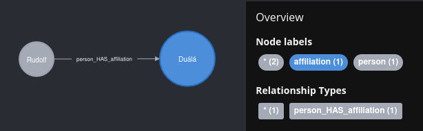
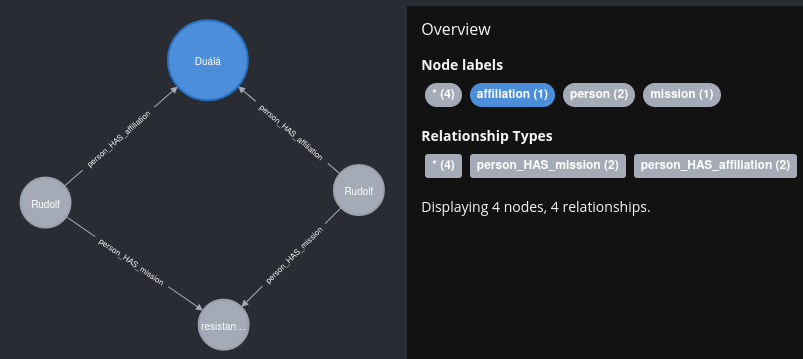
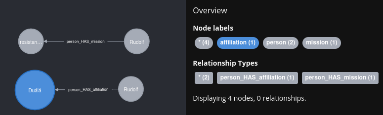
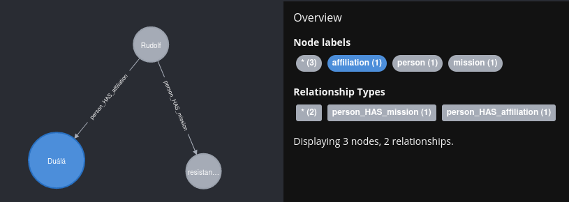

# Basic concepts of dict2graph

To get a grasp how dict2graph is working lets have a look at a simple example

```python
from dict2graph import Dict2graph, Transformer, NodeTrans, RelTrans
from neo4j import GraphDatabase, Driver
NEO4J_DRIVER = GraphDatabase.driver("neo4j://localhost")

dic = {
        "person": {
            "firstname": "Rudolf",
            "lastname": "Manga Bell",
            "age": 41,
            "affiliation": {"name": "Duálá"},
        }
    }
d2g = Dict2graph()
d2g.parse(dic)
d2g.create(NEO4J_DRIVER)
```

This will create a graph that looks like



## Generated labels

You can see dict2graph interpreted the dict key `person` as the objects label. Same for `affiliation`. 

Basic types like strings, integers, boolean and so on will be interpreted as property.

### When creating is not enough

Lets have example with two datasets.


```python
from dict2graph import Dict2graph, Transformer, NodeTrans, RelTrans
from neo4j import GraphDatabase, Driver
NEO4J_DRIVER = GraphDatabase.driver("neo4j://localhost")

data_1 = {
        "person": {
            "firstname": "Rudolf",
            "lastname": "Manga Bell",
            "age": 41,
            "affiliation": {"name": "Duálá"},
        }
    }
data_2 = {
        "person": {
            "firstname": "Rudolf",
            "lastname": "Manga Bell",
            "age": 41,
            "mission": {"name": "resistance leader"},
        }
    }
d2g = Dict2graph()
d2g.parse(data_1)
d2g.parse(data_2)
d2g.create(NEO4J_DRIVER)
```

This results in a pretty unintuitiv graph:



We would expect two node pairs, each with one relationship. Something like:




But what we get is are 4 relationships. Why is that?  

dict2graph creates relationship targets (start node, end node) based on the target nodes labels and properties. So if we have a node that looks equal to another they both will end up as a relatioship target, even we only wanted to relate one of them.

You can workaround that by creating a custom key property. More on that later in the Chapter [`dict2graph.Transformers`](dict2graph/use_transormers.md).

## Merging

In our case it would make sense to just merge equal nodes. We can be pretty sure, in our dataset, that `Rudolf` from dataset 1 is the same as `Rudolf` from dataset 2.

So lets do that:


```python
from dict2graph import Dict2graph, Transformer, NodeTrans, RelTrans
from neo4j import GraphDatabase, Driver
NEO4J_DRIVER = GraphDatabase.driver("neo4j://localhost")

data_1 = {
        "person": {
            "firstname": "Rudolf",
            "lastname": "Manga Bell",
            "age": 41,
            "affiliation": {"name": "Duálá"},
        }
    }
data_2 = {
        "person": {
            "firstname": "Rudolf",
            "lastname": "Manga Bell",
            "age": 41,
            "mission": {"name": "resistance leader"},
        }
    }
d2g = Dict2graph()
d2g.parse(data_1)
d2g.parse(data_2)
d2g.merge(NEO4J_DRIVER)
```


That looks neat, doesn't it? We merged our two dataset in one graph and connected the informations. That what graphs are for in the first place 🚀


