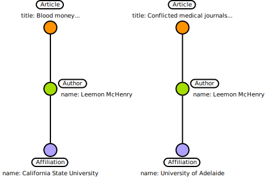
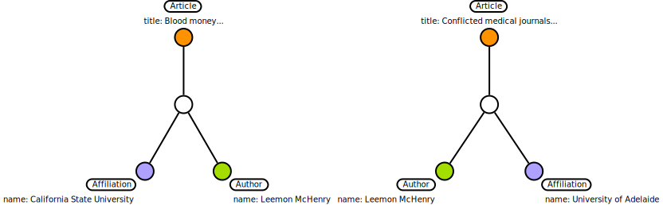
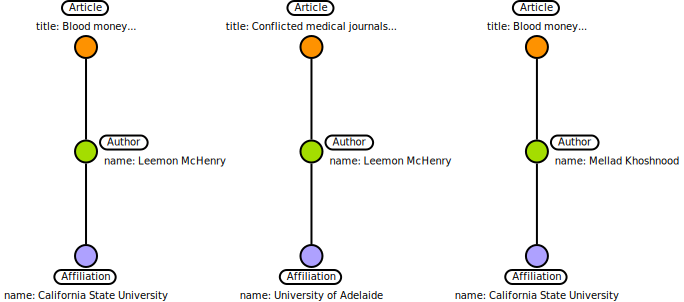

# Hubbing

This chapter explains the concept of hubbing used in the python modules [dict2graph](https://dzd-ev.github.io/dict2graph-docs).
More precise, it is used in the node transformer [`CreateHubbing`](https://dzd-ev.github.io/dict2graph-docs/list_node_transformer/#dict2graph.transformers.node_transformers.CreateHubbing)

For people in a hurry there is [too long;did not read section](#tldr)

## The Problem

When merging multiple overlapping datasets, some relations from parent to child nodes can get lost. 

Lets have an example with two overlapping datasets that will be merged:

**Dataset 1**:
```json
{
    "article": {
        "title": "Blood money: Bayer's inventory of HIV-contaminated blood products and third world hemophiliacs",
        "author": {
            "name": "Leemon McHenry",
            "affiliation": {"name": "California State University"},
        },
    },
}
```


**Dataset 2**:

```json
{
    "article": {
        "title": "Conflicted medical journals and the failure of trust",
        "author": {
            "name": "Leemon McHenry",
            "affiliation": {"name": "University of Adelaide"},
        },
    },
}
```

We have two different articles from the same author. The author contributed to both articles with different affiliations in the background.

Both datasets, each as a graph imported with dict2graph, will have structure like this  
  



When we merge overlapping nodes together, we will have the following result:  
  


**Now can you tell which article was released under which affiliation?** Me neither.

The information got lost, when we merged the two datasets.

There are multiple solutions to this problem. Dict2graph solves this by letting you create new inbetween nodes:

## One solution: Hubbing

With dict2graph you can create "hubs". A new node that is created betweent the parent and its children. 

So our datasets would look like this (before merging):





Here we can still attribute the article to the affiliation without having author duplicates. But how did we get there. Lets take a deep dive:

### The details

As a starting point we want to establish some vocabulary that is used internaly in dict2graph.

#### Vocabulary

To be able to define hubs with dict2graph, we need to point on specific node classes in a node chain. Lets name these:


#### Hub idenitity

When trying to create hubs like in the above shown example another problem will occure:

If we want to merge all our nodes that have the same values and properties, our hubs would merge as well. They need some kind of primary key to be unique.
One solution would be create a random id for each hub. That would work in our example. 

But imagen, at a later stage, we want to merge another dataset:

**Dataset 3**

```json
{
    "article": {
        "title": "Blood money: Bayer's inventory of HIV-contaminated blood products and third world hemophiliacs",
        "author": {
            "name": "Mellad Khoshnood",
            "affiliation": {"name": "California State University"},
        },
    },
}
```

We have another another author for one our existing articles. Lets merge it:


We have a new hub and with new relations. Not wrong but this even less efficient compared to the most simple solution; connection everything directly (In our example an extra article->affiliation relation)

But what if we create a primary key, for the hub, based on the _egde nodes_ only?

We could md5-hash the primary keys from `Article` and `Affiliation` and use this as the primary key for our hub.


With this approach the hubs for **Dataset 2** and **Dataset 3** should have the same primary key. Lets have a look at the result:


This look neat doesn't it? This approach is fairly scalable, even with many authors, affiliations and articles in a dense graph.

In dict2graph this we call this the _"egde merge mode"_. As an alternative there is the _"lead merge mode"_. In this case we build the hub id from _lead nodes_.

The "lead merge mode" could be practible if the data comes in a structure like this:

**Dataset 4**:
```json
{
    "article": {
        "title": "Blood money: Bayer's inventory of HIV-contaminated blood products and third world hemophiliacs",
        "originator": {
            "affiliation": "California State University",
            "author": {
                "name": "Leemon McHenry",
            },
        },
    },
}
```

With dict2graph this would result in a graph roughly looking like this:

<svg xmlns="http://www.w3.org/2000/svg" width="388" height="289" viewBox="0 0 388 289"><defs><style type="text/css"/></defs><g transform="translate(-190.20000076293945 190.35446237388118) scale(1)"><g class="relationship"><g transform="translate(254.4499992132187 -45.659199413432304) rotate(90)" stroke-width="2" stroke="#000000"><path d="M 12 0 L 85.69526296044887 0"/></g></g><g class="relationship"><g transform="translate(254.4499992132187 -143.35446237388118) rotate(90)" stroke-width="2" stroke="#000000"><path d="M 12 0 L 85.69526296044887 0"/></g></g><g class="node"><g fill="#a4dd00" stroke="#000000" stroke-width="2"><circle cx="254.4499992132187" cy="52.03606354701657" r="11"/></g><g transform="translate(254.4499992132187 52.03606354701657)"><g transform="translate(8.572527594031472e-16 14)"><g transform="translate(0 0)"><g transform="translate(-24.825000762939453 0)"><g fill="#ffffff" stroke="#000000" stroke-width="2"><rect x="0" y="0" width="47.650001525878906" height="14" rx="7" ry="7"/><text xml:space="preserve" x="7" y="10" stroke="none" font-family="sans-serif" font-size="10" font-weight="normal" fill="#000000">Author</text></g></g></g><g transform="translate(0 20)"><g transform="translate(-64.24999845027924 0)" fill="white"><rect x="0" y="0" width="128.49999690055847" height="12" rx="0" ry="0" stroke="none"/><g font-family="sans-serif" font-size="10" font-weight="normal" fill="#000000" text-anchor="end"><text xml:space="preserve" x="34.90000033378601" y="9" stroke="none">name:</text><text xml:space="preserve" x="38.08333373069763" y="9" stroke="none" text-anchor="start">Leemon McHenry</text></g></g></g></g></g></g><g class="node"><g fill="#7b64ff" stroke="#000000" stroke-width="2"><circle cx="254.4499992132187" cy="-45.659199413432304" r="11"/></g><g transform="translate(254.4499992132187 -45.659199413432304)"><g transform="translate(14 -16)"><g transform="translate(0 0)"><g transform="translate(0 0)"><g fill="#ffffff" stroke="#000000" stroke-width="2"><rect x="0" y="0" width="61.349998474121094" height="14" rx="7" ry="7"/><text xml:space="preserve" x="7" y="10" stroke="none" font-family="sans-serif" font-size="10" font-weight="normal" fill="#000000">Affiliation</text></g></g></g><g transform="translate(0 20)"><g transform="translate(0 0)" fill="white"><rect x="0" y="0" width="308.8999984264374" height="12" rx="0" ry="0" stroke="none"/><g font-family="sans-serif" font-size="10" font-weight="normal" fill="#000000" text-anchor="end"><text xml:space="preserve" x="34.90000033378601" y="9" stroke="none">name:</text><text xml:space="preserve" x="38.08333373069763" y="9" stroke="none" text-anchor="start">California State University</text></g></g></g></g></g></g><g class="node"><g fill="#e27300" stroke="#000000" stroke-width="2"><circle cx="254.4499992132187" cy="-143.35446237388118" r="11"/></g><g transform="translate(254.4499992132187 -143.35446237388118)"><g transform="translate(8.572527594031472e-16 -46)"><g transform="translate(0 0)"><g transform="translate(-24.04166603088379 0)"><g fill="#ffffff" stroke="#000000" stroke-width="2"><rect x="0" y="0" width="46.08333206176758" height="14" rx="7" ry="7"/><text xml:space="preserve" x="7" y="10" stroke="none" font-family="sans-serif" font-size="10" font-weight="normal" fill="#000000">Article</text></g></g></g><g transform="translate(0 20)"><g transform="translate(-53.13333451747894 0)" fill="white"><rect x="0" y="0" width="106.26666903495789" height="12" rx="0" ry="0" stroke="none"/><g font-family="sans-serif" font-size="10" font-weight="normal" fill="#000000" text-anchor="end"><text xml:space="preserve" x="26.09999918937683" y="9" stroke="none">title:</text><text xml:space="preserve" x="29.283332586288452" y="9" stroke="none" text-anchor="start">Blood money...</text></g></g></g></g></g></g></g></svg>

Almost the same; we need to build the hubs id (again) from a hash of `Article`and `Affiliation` properties. But in this case they are the _leading nodes_. So we operate in the so called _"lead merge mode"_. You get the idea.


### 'Nuff said. Let's code!

All this sounded very work intensive? No worries, you just needed to see the concept once.  
From now on dict2graph will do most of the work for you.

#### Baseline

Lets start with the baseline from above:

```python
from dict2graph import Dict2graph
from neo4j import GraphDatabase

DRIVER = GraphDatabase.driver("neo4j://localhost")
d2g = Dict2graph()
dataset_1 = {
    "article": {
        "title": "Blood money: Bayer's inventory of HIV-contaminated blood products and third world hemophiliacs",
        "author": {
            "name": "Leemon McHenry",
            "affiliation": {
                "name": "California State University"
            },
        },
    },
}
d2g.parse(dataset_1)

dataset_2 = {
    "article": {
        "title": "Conflicted medical journals and the failure of trust",
        "author": {
            "name": "Leemon McHenry",
            "affiliation": {
                "name": "University of Adelaide"
            },
        },
    },
}
d2g.parse(dataset_2)
d2g.merge(DRIVER)
```

Lets have a look in Neo4j to inspect the result:


As expected. Looks nice but the information "under which `affiliation` contributed the `author` to a certain `article`" is lost.

Lets fix that with a hub. We use `Dict2Graph.NodeTrans.CreateHubbing` for that.


#### First hubs

Lets summarize what we need to know to create a hub:

* We need to define a chain of nodes by defining:
    - a _start node_ - as the begining of our chain
    - two or more _follow nodes_ - as the "body of our chain"
* the attributes to be hashed to generate the hub id (lead or edge)
* (Optional) a label for the hub

Lest do it:  
(We assume a fresh/wiped database)
```python
from dict2graph import Dict2graph, Transformer, NodeTrans
from neo4j import GraphDatabase

DRIVER = GraphDatabase.driver("neo4j://localhost")
d2g = Dict2graph()

# we define the start node by matching it with dict2graph
transformer = Transformer.match_nodes("article").do(
        # apply the hubbing-transformer
        NodeTrans.CreateHubbing(
            # define the node chain by defining the follow node labels
            follow_nodes_labels=["author", "affiliation"],
            # define the merge mode
            merge_mode="edge",
            # give the hub node one or more labels
            hub_labels=["Contribution"],
        )
    )
# Add the transformator the tranformator stack of our Dict2graph instance
d2g.add_transformation(transformer)

dataset_1 = {
    "article": {
        "title": "Blood money: Bayer's inventory of HIV-contaminated blood products and third world hemophiliacs",
        "author": {
            "name": "Leemon McHenry",
            "affiliation": {
                "name": "California State University"
            },
        },
    },
}
d2g.parse(dataset_1)

dataset_2 = {
    "article": {
        "title": "Conflicted medical journals and the failure of trust",
        "author": {
            "name": "Leemon McHenry",
            "affiliation": {
                "name": "University of Adelaide"
            },
        },
    },
}
d2g.parse(dataset_2)
d2g.merge(DRIVER)
```


Lets inspect the result:


Nice 🚀 

Lets add our third dataset to prove our theoretical foundations:

#### Complete example

(We assume a fresh/wiped database again)
```python
from dict2graph import Dict2graph, Transformer, NodeTrans
from neo4j import GraphDatabase

DRIVER = GraphDatabase.driver("neo4j://localhost")
d2g = Dict2graph()

# we define the start node by matching it with dict2graph
transformer = Transformer.match_nodes("article").do(
        # apply the hubbing-transformer
        NodeTrans.CreateHubbing(
            # define the node chain by defining the follow node labels
            follow_nodes_labels=["author", "affiliation"],
            # define the merge mode
            merge_mode="edge",
            # give the hub node one or more labels
            hub_labels=["Contribution"],
        )
    )
# Add the transformator the tranformator stack of our Dict2graph instance
d2g.add_transformation(transformer)

dataset_1 = {
    "article": {
        "title": "Blood money: Bayer's inventory of HIV-contaminated blood products and third world hemophiliacs",
        "author": {
            "name": "Leemon McHenry",
            "affiliation": {
                "name": "California State University"
            },
        },
    },
}
d2g.parse(dataset_1)

dataset_2 = {
    "article": {
        "title": "Conflicted medical journals and the failure of trust",
        "author": {
            "name": "Leemon McHenry",
            "affiliation": {
                "name": "University of Adelaide"
            },
        },
    },
}
d2g.parse(dataset_2)
dataaset_3 = {
    "article": {
        "title": "Blood money: Bayer's inventory of HIV-contaminated blood products and third world hemophiliacs",
        "author": {
            "name": "Mellad Khoshnood",
            "affiliation": {"name": "California State University"},
        },
    },
}
d2g.parse(dataaset_3)
d2g.merge(DRIVER)
```


And again, lets have a look in our database:


Oh, don't we love it when a plan comes together!

All `articles`,`affiliations` and `authors` connected as efficient as it can get! And only a handfull extra lines of code (actually!... unformated it would be just **one** line of code 😎).

> 🎖️ Achievement unlocked 
> 
> You are now a Hubber!


## tl;dr


dict2graph helps you to merge multiple datasets without losing informations about parent child relations by creating "hubs".

For example: 


**Step 1**: start with three overlapping datasets:



**Step 2**: Transform them with dict2graph **hubbing** into this:


**Step 3**: and merge them into Neo4j to end up with this:


A compact graph of your three datasets with no duplicate!


Take a look at the [last example](#complete-example) to see how it is done.