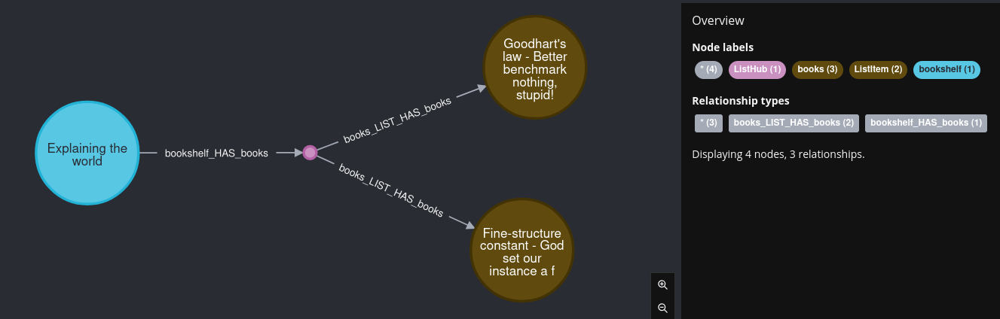

## What is transforming in dict2graph

Internally dict2graph is caching all parsed content before passing it down to [GraphIO](https://github.com/kaiserpreusse/graphio), which loads it into Neo4j.  
This enables us to influence the model in the dict2graph cache before anything goes to Neo4j. In many usecases this can be more perfomant or just more convenient compared to reshaping the model after its loaded into Neo4j.

This "pre"-transforming will not cover all use-cases nore will it be more perfomant in all cases.  
You need to find the right balance.

## How to use

The workflow is:
 
* Create a match/filter for the nodes and relationships you want to manipulate 
* Create a transformer to these nodes and relationships
* Add the transformer to your `Dict2graph` instance
* Parse and load your dict/data


## Matching

The first step to transform your model is to find the parts you want to manipulate.  
In dict2graph this is accomplished by matching or filtering nodes and relationships

`TransformMatcher`s  are targeting the resulting graph-node labels and relationship-types.  
To design your `TransformMatcher` it is recommended to start with a plain run of dict2graph with your data. You then can inspect the resulting nodes and relationships and build matchers to transform these.

!!! hint

    At the moment matching is very basic. It only cover `labels` for nodes and `types` for relationships. Probably there will be more advanced matcher and filters in future versions.

Lets imagen we have a dict like the following

```python
data = {
        "bookshelf": {
            "Genre": "Explaining the world",
            "books": [
                {
                    "title": "Fine-structure constant - God set our instance a fine environment variable",
                },
                {
                    "title": "Goodhart's law - Better benchmark nothing, stupid!",
                },
            ]
        }
    }
```

As a first step lets load it into a neo4j database:


```python
from neo4j import GraphDatabase
from dict2graph import Dict2Graph
NEO4J_DRIVER = GraphDatabase.driver("neo4j://localhost")
data = {
        "bookshelf": {
            "Genre": "Explaining the world",
            "books": [
                {
                    "title": "Fine-structure constant - God set our instance a fine environment variable",
                },
                {
                    "title": "Goodhart's law - Better benchmark nothing, stupid!",
                },
            ]
        }
    }
d2g = Dict2graph()
d2g.parse(data)
d2g.create(NEO4J_DRIVER)
```

This result in the following graph



### Node Matching

If we want to transform certain nodes and relationships (which we will do in a couple of line. i promise), we first need to find them. In dict2graph this is done with so called "matchers".

The most simple matcher you can build is a "match everything" case. **Matching everything is also the default case**. Just keep the matcher empty.

```python
from dict2graph import Transformer, AnyNode

all_matcher = Transformer.match_nodes()
# this is equal to 
all_matcher = Transformer.match_nodes(AnyNode)
```

If we wanted to change `(:books)` nodes only we would build a matcher like this:

```python
from dict2graph import Transformer

books_matcher = Transformer.match_nodes("books")
```

Or we can even match multiple nodes by providing multiples labels.

```python
from dict2graph import Transformer

book_and_shelf_matcher = Transformer.match_nodes(has_one_label_of=["books","bookshelf"])
```
This would match `(:books)` and `(:bookshelf)` nodes.

Filtering out certain labels is also possible
```python
from dict2graph import Transformer

no_bookshelf_matcher = Transformer.match_nodes(has_none_label_of=["bookshelf"])
```
This again, would match only the `(:books)`-nodes.

### Relationship matching

Relationship matching works similar to node matching but it is maybe even simpler. 

As a starter lets see how we match all relationships:

```python
from dict2graph import Transformer

all_rels_matcher = Transformer.match_rels()
```

which is (again) equal to 

```python
from dict2graph import Transformer, AnyRelation

all_rels_matcher = Transformer.match_rels(AnyRelation)
```

Now lets match our `bookshelf_HAS_books` relations.

```python
from dict2graph import Transformer

shelf2book_matcher = Transformer.match_rels("bookshelf_HAS_books")
```

Or how about matching both of our relations?

```python
from dict2graph import Transformer

both_matcher = Transformer.match_rels(
    ["bookshelf_HAS_books", "bookshelf_LIST_HAS_books"]
)
```

Of course filtering is possible as well. lets filter `bookshelf_HAS_books` away

```python
from dict2graph import Transformer

filter_matcher = Transformer.match_rels(
    relation_type_is_not_in=["bookshelf_HAS_books"]
)
```

## Transforming

Great. Now as we know the concept of "matchers" and how to collect our nodes and relationships, lets manipulate them.
For that we need to create so called `Transformer`s

Lets try to add a new property "`material: 'wood'`" to our bookshelf.

We will pick the dict2graph built in node transformer [AddProperty](/dict2graph-docs/list_generic_transformer/#dict2graph.transformers.generic_transformers.AddProperty)

For your convenience you can import the wrapper class `dict2graph.NodeTrans` which includes all Transformers that are applicable to nodes. Same with `dict2graph.RelTrans` for relationship transformators.


```python
from neo4j import GraphDatabase
from dict2graph import Dict2graph,Transformer, NodeTrans

data = {
        "bookshelf": {
            "Genre": "Explaining the world",
            "books": [
                {
                    "title": "Fine-structure constant - God set our instance a fine environment variable",
                },
                {
                    "title": "Goodhart's law - Better benchmark nothing, stupid!",
                },
            ]
        }
    }
# we just learned how to "match". lets apply it:
bookshelf_matcher = Transformer.match_nodes("bookshelf")
add_prop_transformator = NodeTrans.AddProperty({"material":"wood"})

# the next thing we should do is to attach the transformator to our dict2graph instance
match_and_transform = bookshelf_matcher.do(add_prop_transformator)

# to be able to enjoy our work lets push the data to neo4j
# From here this works the same way as we allready learned in the basic tutorial
d2g = Dict2graph()
d2g.add_transformation(match_and_transform)

# parse our dict...
d2g.parse(data)

# ...and push it to the database

NEO4J_DRIVER = GraphDatabase.driver("neo4j://localhost")
d2g.create(NEO4J_DRIVER)
```

If we now query our Neo4j database with 

```cypher
MATCH (bs:bookshelf) return bs.material
```

we get

```json
[
  {
    "bs.material": "wood"
  }
]
```

as a return value. we added a new property to the node.

### Compact variant

Lets tidy up our code.

The same code we just wrote can also look like this:

```python
from neo4j import GraphDatabase
from dict2graph import Dict2graph, Transformer, NodeTrans

data = {
    "bookshelf": {
        "Genre": "Explaining the world",
        "books": [
            {
                "title": "Fine-structure constant - God set our instance a fine environment variable",
            },
            {
                "title": "Goodhart's law - Better benchmark nothing, stupid!",
            },
        ],
    }
}
d2g = Dict2graph()
d2g.add_transformation(
    Transformer.match_nodes("bookshelf").do(NodeTrans.AddProperty({"material": "wood"}))
)
d2g.parse(data)
NEO4J_DRIVER = GraphDatabase.driver("neo4j://localhost")
d2g.create(NEO4J_DRIVER)
```

this is much more compact and depending on your taste more readable. But its just a style question. Choice is yours. But...

## Order matters!

The sequence of your transformers matters. Any transformation is passed to the next transformator.

Lets compare to very similar code snippets. The only differentce will be the sequence of our transformators.

```python
from neo4j import GraphDatabase
from dict2graph import Dict2graph, Transformer, NodeTrans

data = {"bookshelf": {"Genre": "Explaining the world"}}
d2g = Dict2graph()
d2g.add_transformation(
    [
        Transformer.match_nodes("bookshelf").do(NodeTrans.AddProperty({"mtr": "wood"})),
        Transformer.match_nodes("bookshelf").do(
            NodeTrans.OverridePropertyName("mtr", "material")
        ),
    ]
)
d2g.parse(data)
NEO4J_DRIVER = GraphDatabase.driver("neo4j://localhost")
d2g.create(NEO4J_DRIVER)
```

The result of 

```cypher
MATCH (bs:bookshelf) return bs
```

will be 

```
╒══════════════════════════════════════════════════╕
│"bs"                                              │
╞══════════════════════════════════════════════════╡
│{"material":"wood","Genre":"Explaining the world"}│
└──────────────────────────────────────────────────┘
```

Now lets flip the order of our transformators:

```python
from neo4j import GraphDatabase
from dict2graph import Dict2graph, Transformer, NodeTrans

data = {"bookshelf": {"Genre": "Explaining the world"}}
d2g = Dict2graph()
d2g.add_transformation(
    [
        Transformer.match_nodes("bookshelf").do(
            NodeTrans.OverridePropertyName("mtr", "material")
        ),
        Transformer.match_nodes("bookshelf").do(NodeTrans.AddProperty({"mtr": "wood"})),
    ]
)
d2g.parse(data)
NEO4J_DRIVER = GraphDatabase.driver("neo4j://localhost")
d2g.create(NEO4J_DRIVER)
```

The result of 

```cypher
MATCH (bs:bookshelf) return bs
```

will be 

```
╒═════════════════════════════════════════════╕
│"bs"                                         │
╞═════════════════════════════════════════════╡
│{"mtr":"wood","Genre":"Explaining the world"}│
└─────────────────────────────────────────────┘
```


You see in the first case we added the new property first and then renamed it.

In the second case we tried to rename it first. but it was not available yet, as the node Transformator `AddProperty` came after `OverridePropertyName`

So keep that in mind when chaining transformations.